# Apartado 2: SQL

Una vez diseñada la base de datos para gestión de datos hospitalarios, se desea automatizar algunas consultas, verificaciones sobre los datos y funciones/procedimientos. Para ello nos vamos a centrar en algunas tablas específicas de la base de datos, cuya creación y carga de datos se deben realizar a través de la ejecución de los ficheros `.sql` que se indican a continuación. Se pide:

---

## Apartado A

Usando los ficheros hospital_tables.sql y hospital_data.sql disponibles en Moodle, crear la base de datos hospital management system y cargar todos los datos disponibles que van a ser objeto de procesos en puntos posteriores.

### 💻 Código SQL

```sql
DROP DATABASE IF EXISTS hospital_management_system;

SOURCE ./preset-data-creation/hospital_tables.sql;
USE hospital_management_system;
SOURCE ./preset-data-creation/hospital_data.sql;
```

---

## Apartado B

Obtener los nombres de los doctores, los medicamentos y la fecha de prescripcion de los mismos de aquellos doctores que están afiliados al departamento de  “General Medicine” y que han recetado algun medicamento en el año 2023 o 2024.

### 💻 Código SQL

```sql
SELECT physician.name, medication.name, prescribes.date
FROM physician JOIN prescribes ON physician.employeeid = prescribes.physicianid
JOIN medication	ON prescribes.medicationid = medication.code
JOIN affiliated_with ON physician.employeeid = affiliated_with.physicianid
JOIN department ON affiliated_with.departmentid = department.departmentid
WHERE department.name = 'General Medicine' AND (prescribes.date LIKE '%2023' OR prescribes.date LIKE '%2024');
```

### 🖼️ Resultado de la Ejecución

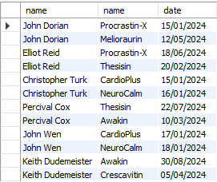

---

## Apartado C

Obtener el nombre del paciente con el ingreso más largo y el paciente con el ingreso más corto en el hospital, mostrando para cada uno su nombre, el número de habitación donde estuvo ingresado, así como el piso y bloque de la misma, la duración de la estancia en días y el tipo de estancia (mas largo o más corto).

### 💻 Código SQL

```sql
(
	SELECT 
		p.name AS Pacient_Name, 
		r.roomnumber AS Room_Number, 
		r.blockfloorid AS Floor_Number, 
		r.blockcodeid AS Block_Code,
		DATEDIFF(STR_TO_DATE(s.end_time, '%d/%m/%Y'), STR_TO_DATE(s.start_time, '%d/%m/%Y')) AS Duration_Days,
		'The Longest' AS Stay_Type
	FROM 
		patient p
	INNER JOIN
		stay s ON p.ssn = s.patientid
	INNER JOIN 
		room r ON s.roomid = r.roomnumber
	WHERE
        DATEDIFF(STR_TO_DATE(s.end_time, '%d/%m/%Y'), STR_TO_DATE(s.start_time, '%d/%m/%Y')) = (
            SELECT
                MAX(DATEDIFF(STR_TO_DATE(end_time, '%d/%m/%Y'), STR_TO_DATE(start_time, '%d/%m/%Y')))
            FROM
                stay
        )
    LIMIT 1
)
UNION ALL
(
    SELECT 
		p.name AS Pacient_Name, 
		r.roomnumber AS Room_Number, 
		r.blockfloorid AS Floor_Number, 
		r.blockcodeid AS Block_Code,
		DATEDIFF(STR_TO_DATE(s.end_time, '%d/%m/%Y'), STR_TO_DATE(s.start_time, '%d/%m/%Y')) AS Duration_Days,
		'The Shortest' AS Stay_Type
	FROM 
		patient p
	INNER JOIN
		stay s ON p.ssn = s.patientid
	INNER JOIN 
		room r ON s.roomid = r.roomnumber
	WHERE
        DATEDIFF(STR_TO_DATE(s.end_time, '%d/%m/%Y'), STR_TO_DATE(s.start_time, '%d/%m/%Y')) = (
            SELECT
                MIN(DATEDIFF(STR_TO_DATE(end_time, '%d/%m/%Y'), STR_TO_DATE(start_time, '%d/%m/%Y')))
            FROM
                stay
        )
    LIMIT 1
);
```

### 🖼️ Resultado de la Ejecución

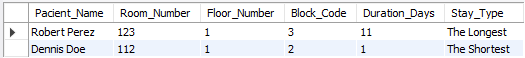

--

## Apartado D

Actualizar la descripción de los medicamentos agregando la nota de “Possible discontinuation” (posible descatalogación) a aquellos que no han sido recetados durante los últimos dos años por doctores pertenecientes al departamento de “General Medicine”, evitando además incluir aquellos que ya contengan dicha advertencia en su descripción actual.

### 💻 Código SQL

```sql
UPDATE medication m
SET m.description = CONCAT(
    IFNULL(m.description, ''),
    CASE
      WHEN m.description IS NULL OR m.description = '' THEN 'Possible discontinuation'
      ELSE ' - Possible discontinuation'
    END
)
WHERE m.code NOT IN (
    SELECT DISTINCT pr.medicationid
    FROM prescribes pr
    JOIN physician ph ON pr.physicianid = ph.employeeid
    JOIN affiliated_with aw ON ph.employeeid = aw.physicianid
    JOIN department d ON aw.departmentid = d.departmentid
    WHERE d.name = 'General Medicine'
      AND DATEDIFF(CURDATE(), STR_TO_DATE(pr.date, '%d/%m/%Y')) <= 730
)
AND (m.description IS NULL OR m.description NOT LIKE '%Possible discontinuation%');

-- Prueba
SELECT * FROM medication;
```

### 🖼️ Resultado de la Ejecución

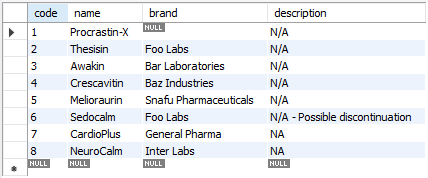

---

## Apartado E

Obtener un listado detallado de los doctores del hospital, mostrando para cada uno su nombre, el número total de procedimientos realizados, el coste total de dichos procedimientos y el coste promedio por procedimiento. Los resultados deben estar ordenados de mayor a menor segun el número de procedimientos realizados.

### 💻 Código SQL

```sql
SELECT p.name AS NAME_PHYSICIAN, ab.NUM_P, ab.T_COSTE, ab.MED_C
FROM physician p JOIN (SELECT physicianid, COUNT(*) AS NUM_P, SUM(cost) AS T_COSTE, AVG(cost) AS MED_C
            						FROM (SELECT p.code, p.cost , u.physicianid  
            								  FROM undergoes u JOIN medical_procedure p ON u.procedureid = p.code)a
            						GROUP BY physicianid  
            						)ab ON p.employeeid = ab.physicianid 
            						ORDER BY ab.NUM_P DESC;
```

### 🖼️ Resultado de la Ejecución

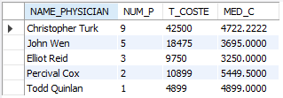

---

## Apartado F

Obtener los doctores (nombre y posicion) que han realizado todos los procedimientos médicos con coste superior a 5000 y que haya realizado más de 3 procedimientos médicos de cualquiera de los tipos en total.

### 💻 Código SQL

```sql
SELECT p.name, p.position FROM physician p
WHERE
    NOT EXISTS (
            SELECT mp.code FROM medical_procedure mp
            WHERE mp.cost > 5000
            AND mp.code NOT IN (
                    SELECT u.procedureid FROM undergoes u
                    WHERE u.physicianid = p.employeeid
                )
    ) AND p.employeeid IN (
        SELECT u2.physicianid FROM undergoes u2
        GROUP BY u2.physicianid
        HAVING COUNT(*) > 3
    );
```

### 🖼️ Resultado de la Ejecución

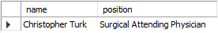

---

## Apartado G

Obtener el personal de enfermería que siempre han estado asignadas a turnos en el mismo sitio (bloque y piso) y que, además, si han participado en procedimientos médicos, siempre haya sido con el mismo doctor.

### 💻 Código SQL

```sql
SELECT n.employeeid,
       n.name,
       oc.blockfloorid,
       oc.blockcodeid,
       u.only_physicianid AS physicianid
FROM nurse n
JOIN (
    SELECT nurseid,
           MIN(blockfloorid) AS blockfloorid,
           MIN(blockcodeid)  AS blockcodeid
    FROM on_call
    GROUP BY nurseid
    HAVING COUNT(DISTINCT CONCAT(blockfloorid,'-',blockcodeid)) = 1
) oc
  ON oc.nurseid = n.employeeid
LEFT JOIN (
    SELECT assistingnurseid,
           COUNT(*) AS num_procs,
           COUNT(DISTINCT physicianid) AS num_docs,
           MIN(physicianid) AS only_physicianid
    FROM undergoes
    GROUP BY assistingnurseid
) u
  ON u.assistingnurseid = n.employeeid
WHERE
   u.assistingnurseid IS NULL
   OR u.num_docs = 1
ORDER BY n.employeeid;
```

### 🖼️ Resultado de la Ejecución

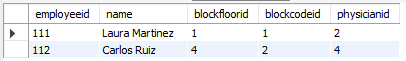

---

## Apartado H

Obtener para cada medicamento (código y nombre) el número total de veces que ha sido prescrito, el nombre del doctor que mas lo ha recetado (si existen empates mostrar todos los doctores empatados), y la dosis promedio recetada. Ordenar los resultados de mayor a menor segun el número total de prescripciones. Tener en cuenta que si existen empates entre los doctores se tienen que mostrar todos los doctores, cada uno en una fila distinta.

### 💻 Código SQL

```sql
SELECT 
    m.code AS codigo_medicamento,
    m.name AS nombre_medicamento,
    t1.total_prescripciones,
    p.name AS doctor_mas_recetador,
    t1.dosis_promedio_recetada
FROM
    medication m
JOIN
    (SELECT  p1.medicationid, 
            COUNT(*) AS total_prescripciones, 
            AVG(p1.dose) AS dosis_promedio_recetada,
            (
                SELECT MAX(conteo)
                FROM (
                    SELECT p2.physicianid, COUNT(*) AS conteo
                    FROM prescribes p2
                    WHERE p2.medicationid = p1.medicationid
                    GROUP BY p2.physicianid
                ) AS frecuencia_por_doctor
            ) AS max_frecuencia_doctor
    FROM prescribes p1
    GROUP BY p1.medicationid
) AS t1 ON t1.medicationid = m.code
JOIN physician p ON p.employeeid IN (
    SELECT p3.physicianid
    FROM prescribes p3
    WHERE p3.medicationid = t1.medicationid
    GROUP BY p3.physicianid
    HAVING COUNT(*) = t1.max_frecuencia_doctor
)
ORDER BY t1.total_prescripciones DESC;
```

### 🖼️ Resultado de la Ejecución

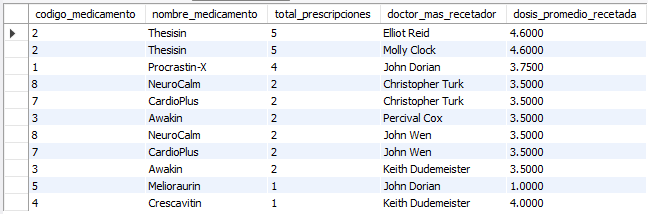

---

## Apartado I

Obtener el nombre de los medicamentos que han sido prescritos por todos los doctores pertenecientes a más de un departamento diferente. 

### 💻 Código SQL

```sql
SELECT m.name
FROM medication m
WHERE m.code IN (
    SELECT p.medicationid
    FROM prescribes p
    WHERE p.physicianid IN (
        SELECT a.physicianid
        FROM affiliated_with a
        GROUP BY a.physicianid
        HAVING COUNT(*) > 1
    )
    GROUP BY p.medicationid
    HAVING COUNT(DISTINCT p.physicianid) = (
        SELECT COUNT(T.physicianid)
        FROM (
            SELECT a.physicianid
            FROM affiliated_with a
            GROUP BY a.physicianid
            HAVING COUNT(*) > 1
        ) AS T
    )
);
```

### 🖼️ Resultado de la Ejecución

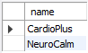

---

## Apartado J

Codifica un trigger que garantice que unicamente los doctores con la formación adecuada y  actualizada puedan programar nuevas intervenciones medicas para las que se han certificado. Es decir, que el certificado sea válido para la fecha del procedimiento que va a realizar. Diferenciar mediante mensajes de error específicos entre ambos casos: los que el doctor no posee la certificacion requerida y aquellos en los que la certificación existe pero se encuentra caducada. Incluir las sentencias SQL para probar el trigger con todos los casos (i.e. que se pueda dar de alta correctamente y ambos errores).

### 💻 Código SQL

```sql
DELIMITER //
CREATE TRIGGER verificar_certificacion_intervencion 
BEFORE INSERT ON undergoes
FOR EACH ROW
BEGIN
    SET @fecha_intervencion = STR_TO_DATE(NEW.date, '%d/%m/%Y');
    IF NOT EXISTS (
        SELECT 1
        FROM trained_in t
        WHERE t.physicianid = NEW.physicianid 
          AND t.treatmentid = NEW.procedureid
    ) THEN
        SIGNAL SQLSTATE '45000'
        SET MESSAGE_TEXT = 'Error: El doctor no posee la certificación requerida para este procedimiento.';
    ELSE
        SELECT MAX(STR_TO_DATE(t.certificationexpires, '%d/%m/%Y')) INTO @max_expiration_date
        FROM trained_in t
        WHERE t.physicianid = NEW.physicianid 
          AND t.treatmentid = NEW.procedureid;
        IF @fecha_intervencion > @max_expiration_date THEN
            SIGNAL SQLSTATE '45000'
            SET MESSAGE_TEXT = 'Error: La certificación del doctor está caducada para este procedimiento.';
        END IF;
    END IF;
END//
DELIMITER ;

-- Sentencias SQL para probar el trigger

-- Caso 1: Doctor con certificación válida
INSERT INTO undergoes (patientid, procedureid, stayid, `date`, physicianid, assistingnurseid) 
VALUES (100000001, 1, 3215, '31/12/2008', 3, 101);
            -- Resultado esperado: La intervención se programa correctamente.

-- Caso 2: Doctor sin certificación requerida
INSERT INTO undergoes (patientid, procedureid, stayid, `date`, physicianid, assistingnurseid) 
VALUES (100000001, 1, 3215, '01/01/2008', 1, 101);
            -- Resultado esperado: Error: El doctor no posee la certificación requerida para este procedimiento.

-- Caso 3: Doctor con certificación caducada
INSERT INTO undergoes (patientid, procedureid, stayid, `date`, physicianid, assistingnurseid) 
VALUES (100000001, 1, 3215, '01/01/2009', 3, 101);
            -- Resultado esperado: Error: La certificación del doctor está caducada para este procedimiento.

-- Elimino la cita de prueba para mantener la integridad de los datos
DELETE FROM undergoes
WHERE 
    patientid = 100000001
    AND procedureid = 1
    AND stayid = 3215
    AND `date` = '31/12/2008';
```

### 🖼️ Resultado de la Ejecución

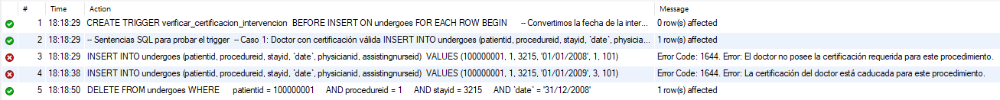

---

## Apartado K

Con el diseno actual de la base de datos, la política de gestion de borrados de pacientes no permite llevar a cabo el borrado de aquellos pacientes que tengan asociado cualquier tipo de información médica sobre ellos. Sin embargo, se desea cambiar esta política de manera que se permita eliminar pacientes bajo condiciones controladas: no tener citas o procedimientos médicos futuros programados y no tener registrado en la base de datos ningún tipo de información de actividad médica (consultas, procedimientos, prescriciones o estancias) durante los últimos 3 años.

Para poder realizar esta gestión, primeramente generar las sentencias SQL necesarias para permitir el borrado de pacientes de la base de datos aunque tengan asociados datos (se borrarán los datos del resto de tablas que tengan asociados).

Posteriormente, codificar un trigger que impida la eliminacion de pacientes que no cumplan  con las condiciones controladas indicadas anteriormente. Dicho trigger debera proporcionar mensajes de error diferenciados para cada una de las situaciones de error que puedan ocurrir. Incluir tambien todas las sentencias SQL necesarias para probar el trigger en todos los casos (i.e. que se se pueda realizar el borrado correctamente así como los diferentes errores).

### 💻 Código SQL

```sql
ALTER TABLE appointments
  ADD CONSTRAINT fk_appointments_patient
  FOREIGN KEY (patientid) REFERENCES patient(ssn)
  ON DELETE CASCADE;

ALTER TABLE prescribes
  ADD CONSTRAINT fk_prescribes_patient
  FOREIGN KEY (patientid) REFERENCES patient(ssn)
  ON DELETE CASCADE;

ALTER TABLE stay
  ADD CONSTRAINT fk_stay_patient
  FOREIGN KEY (patientid) REFERENCES patient(ssn)
  ON DELETE CASCADE;

ALTER TABLE undergoes
  ADD CONSTRAINT fk_undergoes_patient
  FOREIGN KEY (patientid) REFERENCES patient(ssn)
  ON DELETE CASCADE;
  
DROP TRIGGER IF EXISTS trg_patient_before_delete;

DELIMITER //
CREATE TRIGGER trg_patient_before_delete
BEFORE DELETE ON patient
FOR EACH ROW
BEGIN
  DECLARE v_cnt INT DEFAULT 0; -- numero de citas, procedimientos, estancias y preescripciones
  DECLARE v_limit DATE; -- fecha limite
  -- calcula la fecha limite dentro del rango de 3 años
  SET v_limit = DATE_SUB(CURDATE(), INTERVAL 3 YEAR); 
  
  -- 1) Citas futuras 
  SELECT COUNT(*) INTO v_cnt
  FROM appointments a
  WHERE a.patientid = OLD.ssn
    AND STR_TO_DATE(a.start_dt_time, '%e/%c/%Y') > CURDATE(); -- where ( a.start_dt_time > CurrentDate )
  IF v_cnt > 0 THEN
    SIGNAL SQLSTATE '45000'
      SET MESSAGE_TEXT = 'ERROR 1: No se puede borrar el paciente: tiene citas futuras programadas.';
  END IF;
  
  -- 2) Procedimientos futuros 
  SELECT COUNT(*) INTO v_cnt
  FROM undergoes u
  WHERE u.patientid = OLD.ssn
    AND STR_TO_DATE(u.`date`, '%e/%c/%Y') > CURDATE();
  IF v_cnt > 0 THEN
    SIGNAL SQLSTATE '45000'
      SET MESSAGE_TEXT = 'ERROR 2: No se puede borrar el paciente: tiene procedimientos futuros programados.';
  END IF;
  
  -- 3) Actividad en últimos 3 años: procedimientos 
  SELECT COUNT(*) INTO v_cnt
  FROM undergoes u
  WHERE u.patientid = OLD.ssn
    AND STR_TO_DATE(u.`date`, '%e/%c/%Y') >= v_limit;
  IF v_cnt > 0 THEN
    SIGNAL SQLSTATE '45000'
      SET MESSAGE_TEXT = 'ERROR 3: No se puede borrar el paciente: tiene actividad de procedimientos en los últimos 3 años.';
  END IF;
  
  -- 4) Actividad en últimos 3 años: consultas (citas) 
  SELECT COUNT(*) INTO v_cnt
  FROM appointments a
  WHERE a.patientid = OLD.ssn
    AND STR_TO_DATE(a.start_dt_time, '%e/%c/%Y') >= v_limit;
  IF v_cnt > 0 THEN
    SIGNAL SQLSTATE '45000'
      SET MESSAGE_TEXT = 'ERROR 4: No se puede borrar el paciente: tiene actividad de consultas (citas) en los últimos 3 años.';
  END IF;
  
  -- 5) Actividad en últimos 3 años: prescripciones 
  SELECT COUNT(*) INTO v_cnt
  FROM prescribes p
  WHERE p.patientid = OLD.ssn
    AND STR_TO_DATE(p.`date`, '%e/%c/%Y') >= v_limit;
  IF v_cnt > 0 THEN
    SIGNAL SQLSTATE '45000'
      SET MESSAGE_TEXT = 'ERROR 5: No se puede borrar el paciente: tiene actividad de prescripciones en los últimos 3 años.';
  END IF;

  -- 6) Actividad en últimos 3 años: estancias (inicio o fin en ventana) 
  SELECT COUNT(*) INTO v_cnt
  FROM stay s
  WHERE s.patientid = OLD.ssn
    AND (
      STR_TO_DATE(s.start_time, '%e/%c/%Y') >= v_limit
      OR STR_TO_DATE(s.end_time,   '%e/%c/%Y') >= v_limit
    );
  IF v_cnt > 0 THEN
    SIGNAL SQLSTATE '45000'
      SET MESSAGE_TEXT = 'ERROR 6: No se puede borrar el paciente: tiene actividad de estancias en los últimos 3 años.';
  END IF;
END//
DELIMITER ;


-- TEST 1: OK
DELETE FROM patient WHERE ssn = 400000001;

INSERT INTO patient (ssn, name, address, phonenum, insuranceid, pcpid)
VALUES (400000001, 'TEST_1', 'Calle 1', '600-000-001', 94000001, 1);

DELETE FROM patient WHERE ssn = 400000001;
-- Esperado: OK


-- TEST 2: ERROR 1 (citas futuras)
DELETE FROM appointments WHERE patientid = 400000002;
DELETE FROM patient WHERE ssn = 400000002;

INSERT INTO patient (ssn, name, address, phonenum, insuranceid, pcpid)
VALUES (400000002, 'TEST_2', 'Calle 2', '600-000-002', 94000002, 1);

INSERT INTO appointments (appointmentid, patientid, prepnurseid, physicianid, start_dt_time, end_dt_time, examinationroom)
VALUES (
  94000002, 400000002, 101, 1,
  DATE_FORMAT(DATE_ADD(CURDATE(), INTERVAL 10 DAY), '%e/%c/%Y'),
  DATE_FORMAT(DATE_ADD(CURDATE(), INTERVAL 10 DAY), '%e/%c/%Y'),
  'A'
);

DELETE FROM patient WHERE ssn = 400000002;
-- Esperado: ERROR 1


-- TEST 3: ERROR 2 (procedimiento futuro)
DELETE FROM undergoes WHERE patientid = 400000003;
DELETE FROM stay WHERE patientid = 400000003;
DELETE FROM patient WHERE ssn = 400000003;

INSERT INTO patient (ssn, name, address, phonenum, insuranceid, pcpid)
VALUES (400000003, 'TEST_3', 'Calle 3', '600-000-003', 94000003, 1);

INSERT INTO stay (stayid, patientid, roomid, start_time, end_time)
VALUES (
  94000003, 400000003, 101,
  DATE_FORMAT(CURDATE(), '%e/%c/%Y'),
  DATE_FORMAT(DATE_ADD(CURDATE(), INTERVAL 5 DAY), '%e/%c/%Y')
);

INSERT INTO trained_in (physicianid, treatmentid, certificationdate, certificationexpires)
VALUES (1, 1, '01/10/2025', '01/10/2026');

INSERT INTO undergoes (patientid, procedureid, stayid, `date`, physicianid, assistingnurseid)
VALUES (
  400000003, 1, 94000003,
  DATE_FORMAT(DATE_ADD(CURDATE(), INTERVAL 30 DAY), '%e/%c/%Y'),
  1, 101
);

DELETE FROM patient WHERE ssn = 400000003;
-- Esperado: ERROR 2


-- TEST 4: ERROR 3 (procedimientos recientes)
DELETE FROM undergoes WHERE patientid = 400000004;
DELETE FROM stay WHERE patientid = 400000004;
DELETE FROM patient WHERE ssn = 400000004;

INSERT INTO patient (ssn, name, address, phonenum, insuranceid, pcpid)
VALUES (400000004, 'TEST_4', 'Calle 4', '600-000-004', 94000004, 1);

INSERT INTO stay (stayid, patientid, roomid, start_time, end_time)
VALUES (
  94000004, 400000004, 101,
  DATE_FORMAT(DATE_SUB(CURDATE(), INTERVAL 1 YEAR), '%e/%c/%Y'),
  DATE_FORMAT(DATE_SUB(CURDATE(), INTERVAL 11 MONTH), '%e/%c/%Y')
);

INSERT INTO undergoes (patientid, procedureid, stayid, `date`, physicianid, assistingnurseid)
VALUES (
  400000004, 1, 94000004,
  DATE_FORMAT(DATE_SUB(CURDATE(), INTERVAL 6 MONTH), '%e/%c/%Y'),
  1, 101
);

DELETE FROM patient WHERE ssn = 400000004;
-- Esperado: ERROR 3


-- TEST 5: ERROR 4 (citas recientes)
DELETE FROM appointments WHERE patientid = 400000005;
DELETE FROM patient WHERE ssn = 400000005;

INSERT INTO patient (ssn, name, address, phonenum, insuranceid, pcpid)
VALUES (400000005, 'TEST_5', 'Calle 5', '600-000-005', 94000005, 1);

INSERT INTO appointments (appointmentid, patientid, prepnurseid, physicianid, start_dt_time, end_dt_time, examinationroom)
VALUES (
  94000005, 400000005, 101, 1,
  DATE_FORMAT(DATE_SUB(CURDATE(), INTERVAL 100 DAY), '%e/%c/%Y'),
  DATE_FORMAT(DATE_SUB(CURDATE(), INTERVAL 100 DAY), '%e/%c/%Y'),
  'B'
);

DELETE FROM patient WHERE ssn = 400000005;
-- Esperado: ERROR 4


-- TEST 6: ERROR 5 (prescripciones recientes)
DELETE FROM prescribes WHERE patientid = 400000006;
DELETE FROM appointments WHERE patientid = 400000006;
DELETE FROM patient WHERE ssn = 400000006;

INSERT INTO patient (ssn, name, address, phonenum, insuranceid, pcpid)
VALUES (400000006, 'TEST_6', 'Calle 6', '600-000-006', 94000006, 1);

INSERT INTO appointments (appointmentid, patientid, prepnurseid, physicianid, start_dt_time, end_dt_time, examinationroom)
VALUES (
  94000006, 400000006, 101, 1,
  DATE_FORMAT(DATE_SUB(CURDATE(), INTERVAL 5 YEAR), '%e/%c/%Y'),
  DATE_FORMAT(DATE_SUB(CURDATE(), INTERVAL 5 YEAR), '%e/%c/%Y'),
  'C'
);

INSERT INTO prescribes (physicianid, patientid, medicationid, `date`, appointmentid, dose)
VALUES (
  1, 400000006, 1,
  DATE_FORMAT(DATE_SUB(CURDATE(), INTERVAL 50 DAY), '%e/%c/%Y'),
  94000006, 1
);

DELETE FROM patient WHERE ssn = 400000006;
-- Esperado: ERROR 5


-- TEST 7: ERROR 6 (estancias recientes)
DELETE FROM stay WHERE patientid = 400000007;
DELETE FROM patient WHERE ssn = 400000007;

INSERT INTO patient (ssn, name, address, phonenum, insuranceid, pcpid)
VALUES (400000007, 'TEST_7', 'Calle 7', '600-000-007', 94000007, 1);

INSERT INTO stay (stayid, patientid, roomid, start_time, end_time)
VALUES (
  94000007, 400000007, 101,
  DATE_FORMAT(DATE_SUB(CURDATE(), INTERVAL 1 YEAR), '%e/%c/%Y'),
  DATE_FORMAT(DATE_SUB(CURDATE(), INTERVAL 11 MONTH), '%e/%c/%Y')
);

DELETE FROM patient WHERE ssn = 400000007;
-- Esperado: ERROR 6
```

### 🖼️ Resultado de la Ejecución

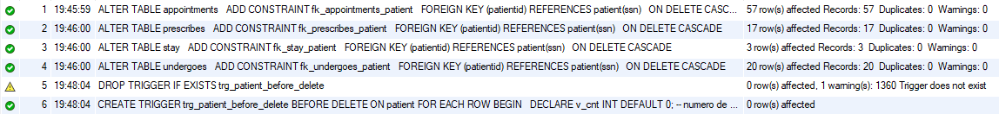

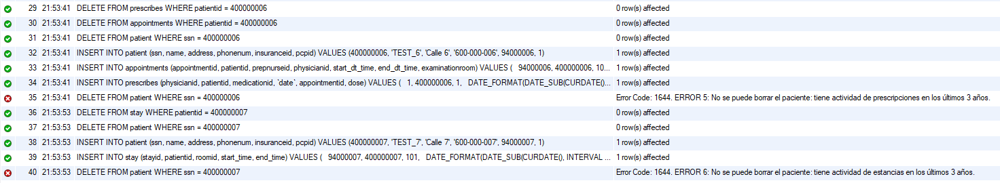

---

## Apartado L

Codifica una funcion almacenada denominada 'total_cost_patient' que calcule y devuelva el coste total acumulado de todos los procedimientos medicos registrados en la tabla 'undergoes' que un paciente, pasado como parámetro, haya recibido. Infiere los tipos de datos tanto del coste total como del identificador del paciente a partir de los datos con los que las tablas fueron creadas.

Tras crear la funcion almacenada 'total_cost_patient', realiza una consulta en SQL que, haciendo uso de la función, liste los datos del paciente que mayor coste total acumulado en procedimientos medicos.

### 💻 Código SQL

```sql
DELIMITER $$
CREATE FUNCTION total_cost_patient(patient_SSN INT)
RETURNS INT
DETERMINISTIC
BEGIN
	DECLARE total_cost INT DEFAULT 0;
    SELECT SUM(mp.cost) INTO total_cost
    FROM undergoes u
    INNER JOIN medical_procedure mp
		ON u.procedureid = mp.code
	WHERE u.patientid = patient_ssn;
    RETURN total_cost;
END$$
DELIMITER ;

-- Prueba
SELECT 
	p.*
FROM patient p
ORDER BY total_cost_patient(p.ssn) DESC
LIMIT 1;
```

### 🖼️ Resultado de la Ejecución

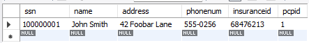

---

## Apartado M

Codifica una funcion almacenada denominada 'calc_stay_cost' que calcule y devuelva el coste total de una estancia pasada como parámetro. Para determinar dicho coste, considera que las habitaciones de tipo ICU tienen un coste de 500e/día, las Single de 300e/día, las Double de 150e/día y otros tipos de habitaciones tienen un coste de 100e/día. Para determinar la duración de una estancia busca información a cerca de las funciones 'DATEDIFF' y 'STR_TO_DATE'.  Incluye tambien todas las sentencias SQL necesarias para probar la función almacenada.

### 💻 Código SQL

```sql
DELIMITER $$
CREATE FUNCTION calc_stay_cost(stayid INT)
RETURNS INT
DETERMINISTIC
BEGIN
	DECLARE room_type VARCHAR(8);
	DECLARE start_time VARCHAR(10);
	DECLARE end_time VARCHAR(10);
	DECLARE start_date DATE;
	DECLARE end_date DATE;
	DECLARE stay_time INT;
	DECLARE actual INT;
	DECLARE total INT;
	SELECT stay.start_time, stay.end_time, room.roomtype
    INTO start_time, end_time, room_type
	FROM stay JOIN room ON stay.roomid = room.roomnumber
    WHERE stay.stayid = stayid;
	SET start_date = STR_TO_DATE(start_time, '%d/%m/%Y');
	SET end_date = STR_TO_DATE(end_time, '%d/%m/%Y');
	SET stay_time = datediff(end_date, start_date) + 1;
	SET actual = CASE room_type
		WHEN 'ICU' THEN 500
		WHEN 'Single' THEN 300
		WHEN 'Double' THEN 150
		ELSE 100
	END;
	SET total = actual*stay_time;
	RETURN total;
END $$
DELIMITER ;

-- Prueba
SELECT calc_stay_cost(3215) AS total_cost;
```

### 🖼️ Resultado de la Ejecución

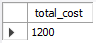

---

## Apartado N

Codifica un procedimiento almacenado denominado 'physician_report' que permita generar un reporte de texto con los pacientes atendidos por un doctor y las medicinas que les han prescrito. El procedimiento recibirá como entrada el identificador del doctor y el rango de fechas sobre las que se desea generar el informe. Se dispondra de un parámetro de salida de tipo TEXT que contendra el un informe como el que se muestra a continuación:

   INFORME DE John Dorian

   John Smith (24/4/2008)


   \# Procrastin-X

   John Smith (25/4/2008)

   \# No medications prescribed

La primera línea indicara el nombre del doctor. En las lineas sucesivas se indicará el nombre del paciente atendido y la fecha en la que atendio así como los nombres de los medicamentos prescritos en la consulta. Si no se recetó ningún medicamento se indicará "No medications prescribed". Las consultas deberan ordenarse cronológicamente. Incluye también todas las sentencias SQL necesarias para probar el procedimiento almacenado.

### 💻 Código SQL

```sql
DELIMITER $$
CREATE PROCEDURE physician_report (IN doctorid INT, IN startdate VARCHAR(10), IN enddate VARCHAR(10), OUT result TEXT)
BEGIN
  	DECLARE l_done INT DEFAULT FALSE;
    DECLARE l_patient_name VARCHAR(20);
    DECLARE l_doctor_name VARCHAR(20);
    DECLARE l_start_date VARCHAR(10);
    DECLARE l_appointment_id INT;
    DECLARE l_num_med INT;
  	DECLARE l_medication_name VARCHAR(20);
    
  	DECLARE l_cur CURSOR FOR 
		SELECT p.name, start_dt_time, a.appointmentid
		FROM patient p JOIN appointments a ON p.ssn = a.patientid JOIN physician ph ON a.physicianid = ph.employeeid 
		WHERE ph.employeeid = doctorid AND str_to_date(start_dt_time,'%e/%c/%Y') BETWEEN str_to_date(startdate,'%e/%c/%Y') AND str_to_date(enddate,'%e/%c/%Y')
		ORDER BY str_to_date(start_dt_time,'%e/%c/%Y');
  	DECLARE CONTINUE HANDLER FOR NOT FOUND SET l_done = TRUE;
    
    SELECT name INTO l_doctor_name
  	FROM physician 
  	WHERE employeeid = doctorid;
    
    IF l_doctor_name IS NULL THEN
		SET result = 'Error: Physician not found';	
    ELSE
		SET result = CONCAT('INFORME DE ', l_doctor_name, '\n\n');
		
        OPEN l_cur;
        
		read_loop: LOOP
			FETCH l_cur INTO l_patient_name, l_start_date, l_appointment_id;
		
			IF l_done THEN
				LEAVE read_loop;
			END IF;
            
			SET result = CONCAT (result, l_patient_name,' (',l_start_date,')\n');
		
      SELECT COUNT(*) INTO l_num_med
			FROM prescribes 
			WHERE appointmentid = l_appointment_id AND physicianid = doctorid;
				
			IF l_num_med = 0 THEN
				SET result = CONCAT(result,'# No medications prescribed\n\n');
			ELSE
				SELECT m.name INTO l_medication_name
				FROM prescribes pr JOIN medication m ON pr.medicationid = m.code
				WHERE pr.appointmentid = l_appointment_id AND pr.physicianid = doctorid;

				SET result = CONCAT(result,'# ', l_medication_name, '\n\n');
					
        SET l_done = FALSE;
			END IF;
		END LOOP;
		CLOSE l_cur;
   END IF;
END$$
DELIMITER ;

-- ============================================================================
-- PRUEBAS DEL PROCEDIMIENTO
-- ============================================================================

-- Prueba 1: Dr. John Dorian (ID=1)  5 consultas 
CALL physician_report(1, '25/4/2008', '13/7/2023', @result);
SELECT @result AS INFORME;

-- Prueba 2: Dr. Elliot Reid (ID=2) 3 consultas
CALL physician_report(2, '24/4/2008', '27/4/2008', @result);
SELECT @result AS INFORME;

-- Prueba 3: Dr. Christopher Turk (ID=3) 3 consultas
CALL physician_report(3, '20/3/2008', '30/4/2023', @result);
SELECT @result AS INFORME;

-- Prueba 4: Dr. Molly Clock (ID=9) 1 consulta
CALL physician_report(9, '27/4/2008', '30/4/2008', @result);
SELECT @result AS INFORME;

-- Prueba 5: Doctor no existente
CALL physician_report(-1, '27/4/2008', '30/4/2008', @result);
SELECT @result AS INFORME;
```

### 🖼️ Resultado de la Ejecución

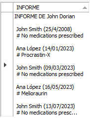
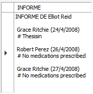
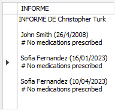


